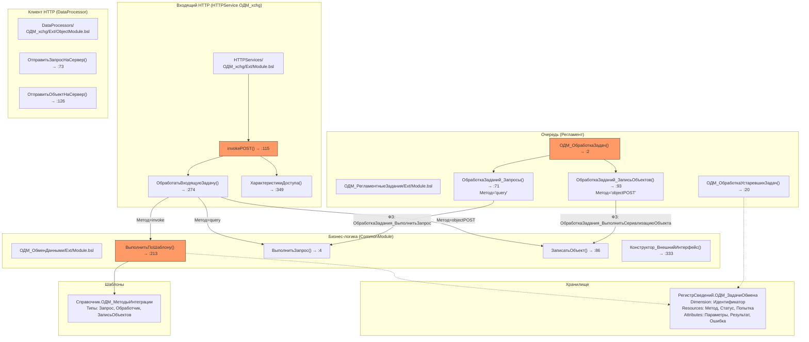
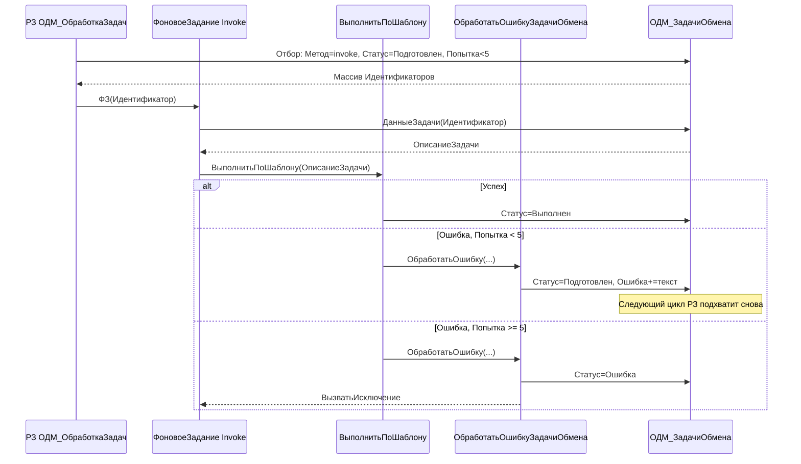

# Архитектура расширения invoke: очередь, повтор, обмен между базами

**Last Updated:** 2026-05-28
**Версия подсистемы:** 0.0.0.1
**Платформа:** 8.3.24+

## Overview

Расширение существующего HTTP-сервиса `/invoke` (подсистема `ОДМ_xchg`):
- **Очередь** — async-invoke-задачи обрабатываются регламентным заданием
- **Повтор** — при ошибке invoke-задачи возвращаются в статус `Подготовлен` (до 5 попыток)
- **Обмен между базами** — исходящий invoke через существующий endpoint `/invoke`, без новых URL

---

## Текущее состояние (as-is)

### Component Diagram



### Ключевые разрывы (gaps)

| # | Проблема | Где | Последствия |
|---|----------|-----|-------------|
| 1 | **invoke не в РЗ**: `ОДМ_ОбработкаЗадач` запускает фоновые только для `query` и `objectPOST` | `ОДМ_РегламентныеЗадания:9-13` | Async-invoke-задачи висят в `Подготовлен` вечно |
| 2 | **Нет повтора**: ошибка в `ВыполнитьПоШаблону` → `Ошибка` + исключение, без возврата в `Подготовлен` | `ОДМ_ОбменДанными:278-288` | Любая ошибка фатальна с первой попытки |
| 3 | **Нет исходящего invoke**: клиент умеет `query` и `objectPOST`, но не `/invoke` | `DataProcessors/ОДМ_xchg/ObjectModule.bsl` | Межбазовый обмен через invoke невозможен |
| 4 | **Нет предпросмотра JSON**: нельзя посмотреть тело запроса до отправки | Форма шаблона, `invokePOST` | Отладка — только «отправил → посмотрел лог» |

### Идиомы кода (сохраняемые паттерны)

- **Фоновое задание в РЗ**: `ФоновыеЗадания.Выполнить("Модуль.Метод", Идентификатор, Ключ)` — стр. 12-13
- **Отбор задач**: `Метод = &Метод И Статус В(&АктивныеСтатусы) И Попытка < &Попытка` — стр. 75-81
- **Чтение задачи**: `РегистрыСведений.ОДМ_ЗадачиОбмена.ДанныеЗадачи(Идентификатор)` → структура через `Конструктор_ОписаниеЗадачи()` — стр. 39-53 ManagerModule
- **Доступ**: `ХарактеристикиДоступа()` — для `/invoke` читает `connectionPath` из **заголовка** — стр. 360
- **Клиент HTTP**: `Конструктор_ВнешнийИнтерфейс()` → `Соединение.ВызватьHTTPМетод()` — стр. 333 ОбменДанными, стр. 169 ObjectModule
- **Двойной роутер**: дублирование диспетчеризации в HTTP (`ОбработатьВходящуюЗадачу:321`) и РЗ (`ОДМ_ОбработкаЗадач:9`) — **сохраняем**, добавляем новые ветки в оба

---

## Целевая архитектура (to-be)

### Data Flow — межбазовый обмен

```mermaid
flowchart LR
    subgraph sender["База-отправитель"]
        UI["Код / форма:<br/>СоздатьЗадачуInvokeОтправки()"]
        Q["ОДМ_ЗадачиОбмена<br/>Метод='invokeОтправить'<br/>Статус=Подготовлен"]
        RJ["РЗ ОДМ_ОбработкаЗадач<br/>→ ОбработкаЗаданий_InvokeОтправить()"]
        CLI["ОДМ_xchg клиент<br/>→ ОтправитьInvokeНаСервер()"]
        UI -->|"Запись в регистр"| Q
        Q -->|"Отбор: Метод+Статус+Попытка"| RJ
        RJ -->|"POST /invoke + заголовок connectionPath"| CLI
    end

    subgraph receiver["База-получатель"]
        HTTP["HTTPService<br/>POST /hs/MRS_xchg/invoke"]
        RTR["ОбработатьВходящуюЗадачу()"]
        TPL["ВыполнитьПоШаблону()"]
        Q_RECV["ОДМ_ЗадачиОбмена<br/>Метод='invoke'"]
        RJ_RECV["РЗ → ОбработкаЗаданий_Invoke()"]
        HTTP -->|"Режим=Очередь или ?async"| RTR
        RTR -->|"async / Очередь"| Q_RECV
        Q_RECV --> RJ_RECV
        RJ_RECV --> TPL
        RTR -->|"синхронно"| TPL
    end

    CLI -->|"Тело: {Шаблон, ...}<br/>Заголовок: connectionPath"| HTTP
```



### Data Flow — повтор (retry)



---

## Покомпонентный дизайн

### Фаза 1 — Регламентная обработка invoke (приём)

**Файл:** `CommonModules/ОДМ_РегламентныеЗадания/Ext/Module.bsl`

#### Новый метод: `ОбработкаЗаданий_Invoke()`

Копирует паттерн `ОбработкаЗаданий_Запросы` (строка 71):

```bsl
Процедура ОбработкаЗаданий_Invoke() Экспорт

    Запрос = Новый Запрос("ВЫБРАТЬ
                          |    т.Идентификатор КАК Идентификатор
                          |ИЗ
                          |    РегистрСведений.ОДМ_ЗадачиОбмена КАК т
                          |ГДЕ
                          |    т.Метод = &Метод
                          |    И т.Статус В (&АктивныеСтатусы)
                          |    И т.Попытка < &Попытка");
    Запрос.Параметры.Вставить("Метод",              "invoke");
    Запрос.Параметры.Вставить("АктивныеСтатусы",    Перечисления.ОДМ_СтатусыЗадач.АктивныеСтатусы());
    Запрос.Параметры.Вставить("Попытка",            КоличествоПопытокНаЗадачу());
    Выборка = Запрос.Выполнить().Выбрать();

    Пока Выборка.Следующий() Цикл
        ФоновыеЗадания.Выполнить("ОДМ_РегламентныеЗадания.ОбработкаЗадания_ВыполнитьInvoke",
            Выборка.Идентификатор, Выборка.Идентификатор);
    КонецЦикла;

КонецПроцедуры
```

#### Новый метод: `ОбработкаЗадания_ВыполнитьInvoke(Идентификатор)`

```bsl
Процедура ОбработкаЗадания_ВыполнитьInvoke(Знач Идентификатор) Экспорт

    Задача = РегистрыСведений.ОДМ_ЗадачиОбмена.ДанныеЗадачи(Идентификатор);
    ОДМ_ОбменДанными.ВыполнитьПоШаблону(Задача);

КонецПроцедуры
```

#### Модификация: `ОДМ_ОбработкаЗадач()` — добавить строку запуска

После строки 13 (существующий `ФоновыеЗадания.Выполнить(...ОбработкаЗаданий_ЗаписьОбъектов...)`):

```bsl
//FIXME: плохой роутер - связать
ФоновыеЗадания.Выполнить("ОДМ_РегламентныеЗадания.ОбработкаЗаданий_Запросы",       , "ОбработкаЗаданий_Запросы");
ФоновыеЗадания.Выполнить("ОДМ_РегламентныеЗадания.ОбработкаЗаданий_ЗаписьОбъектов", , "ОбработкаЗаданий_ЗаписьОбъектов");
ФоновыеЗадания.Выполнить("ОДМ_РегламентныеЗадания.ОбработкаЗаданий_Invoke",        , "ОбработкаЗаданий_Invoke");
//<-
```

---

### Фаза 2 — Исходящий invoke между базами

#### Новый метод в клиенте HTTP

**Файл:** `DataProcessors/ОДМ_xchg/Ext/ObjectModule.bsl`

```bsl
// Отправляет invoke-запрос на удалённый /invoke endpoint.
// Использует заголовок connectionPath (а не URL-параметр initiator),
// так как /invoke читает connectionPath из заголовков — см. ХарактеристикиДоступа():360.
//
// Параметры:
//   ПараметрыInvoke - Структура - тело запроса: {"Шаблон": "...", ...}
//   Асинхронно      - Булево    - если Истина, добавляет ?async=UUID к URL
//   КоличествоПопыток - Число   - число retry на стороне клиента (по умолчанию 3)
//
// Возвращаемое значение:
//   Структура - результат десериализации JSON-ответа
Функция ОтправитьInvokeНаСервер(Знач ПараметрыInvoke, Знач Асинхронно = Ложь,
                                  Знач КоличествоПопыток = 3) Экспорт

    АдресРесурса = СтрШаблон("/%1/hs/MRS_xchg/invoke", ИмяБазы);
    Если Асинхронно Тогда
        АдресРесурса = СтрШаблон("%1?async=%2", АдресРесурса, Новый УникальныйИдентификатор);
    КонецЕсли;

    ЗаголовкиВызова = Конструктор_Заголовки();
    ЗаголовкиВызова.Вставить("connectionPath", СтрокаСоединенияИнформационнойБазы());

    ТелоJSON = ОДМ_ОбменДанными.СериализоватьJSON(ПараметрыInvoke);

    ОтветHTTP = Неопределено;
    Для Попытка = 1 По КоличествоПопыток Цикл
        Попытка
            Если Соединение = Неопределено Тогда
                УстановитьХТТПСоединение();
            КонецЕсли;

            ЗапросHTTP = Новый HTTPЗапрос(АдресРесурса, ЗаголовкиВызова);
            ЗапросHTTP.УстановитьТелоИзСтроки(ТелоJSON);
            ОтветHTTP = Соединение.ВызватьHTTPМетод("POST", ЗапросHTTP);

            Если ОтветHTTP.КодСостояния = 200 Тогда
                Прервать;
            КонецЕсли;
        Исключение
            Если Попытка = КоличествоПопыток Тогда
                ВызватьИсключение;
            КонецЕсли;
            Пауза(Попытка * 1000); // 1с, 2с, 3с
        КонецПопытки;
    КонецЦикла;

    ТелоОтветаСтрокой = ОтветHTTP.ПолучитьТелоКакСтроку();
    Возврат ОДМ_ОбменДанными.ДесериализоватьJSON(ТелоОтветаСтрокой);

КонецФункции
```

**Решение:** `connectionPath` — заголовком, retry — 3 попытки с прогрессивной паузой (идея из Connector, без подключения библиотеки).

#### Метод создания задачи на отправку

**Файл:** `CommonModules/ОДМ_ОбменДанными/Ext/Module.bsl`

```bsl
// Создаёт задачу в регистре ОДМ_ЗадачиОбмена для последующей отправки invoke
// в другую базу через регламентное задание.
//
// Параметры:
//   БазаПолучатель - Строка    - имя базы-получателя (публикация веб-сервера)
//   КодШаблона     - Строка    - код шаблона из ОДМ_МетодыИнтеграции на стороне получателя
//   Параметры      - Структура - payload для invoke (попадёт в тело JSON)
//   ДопПараметры   - Структура - необязательные: АдресСервера, Порт, Логин, Пароль
//
// Возвращаемое значение:
//   Строка - GUID созданной задачи
Функция СоздатьЗадачуInvokeОтправки(Знач БазаПолучатель, Знач КодШаблона,
                                     Знач Параметры, Знач ДопПараметры = Неопределено) Экспорт

    Идентификатор = Новый УникальныйИдентификатор;

    ОписаниеЗадачи = Конструктор_ОписаниеЗадачи(Идентификатор);
    ОписаниеЗадачи.Метод  = "invokeОтправить";
    ОписаниеЗадачи.Статус = Перечисления.ОДМ_СтатусыЗадач.Подготовлен;

    Данные = Новый Структура;
    Данные.Вставить("Шаблон",         КодШаблона);
    Данные.Вставить("БазаПолучатель", БазаПолучатель);
    Данные.Вставить("Параметры",      Параметры);

    Если ДопПараметры <> Неопределено Тогда
        Данные.Вставить("АдресСервера", ДопПараметры.Свойство("АдресСервера"));
        Данные.Вставить("Порт",         ДопПараметры.Свойство("Порт"));
        Данные.Вставить("Логин",        ДопПараметры.Свойство("Логин"));
        Данные.Вставить("Пароль",       ДопПараметры.Свойство("Пароль"));
    КонецЕсли;

    ОписаниеЗадачи.Параметры = Данные;

    РегистрыСведений.ОДМ_ЗадачиОбмена.ЗаписатьДанныеЗадач(ОписаниеЗадачи);

    Возврат Строка(Идентификатор);

КонецФункции
```

#### Обработчик исходящих invoke в РЗ

**Файл:** `CommonModules/ОДМ_РегламентныеЗадания/Ext/Module.bsl`

```bsl
// Обрабатывает задачи с методом "invokeОтправить" — вызывает удалённый /invoke
// через клиент ОДМ_xchg.
Процедура ОбработкаЗаданий_InvokeОтправить() Экспорт

    Запрос = Новый Запрос("ВЫБРАТЬ
                          |    т.Идентификатор КАК Идентификатор
                          |ИЗ
                          |    РегистрСведений.ОДМ_ЗадачиОбмена КАК т
                          |ГДЕ
                          |    т.Метод = &Метод
                          |    И т.Статус В (&АктивныеСтатусы)
                          |    И т.Попытка < &Попытка");
    Запрос.Параметры.Вставить("Метод",              "invokeОтправить");
    Запрос.Параметры.Вставить("АктивныеСтатусы",    Перечисления.ОДМ_СтатусыЗадач.АктивныеСтатусы());
    Запрос.Параметры.Вставить("Попытка",            КоличествоПопытокНаЗадачу());
    Выборка = Запрос.Выполнить().Выбрать();

    Пока Выборка.Следующий() Цикл
        ФоновыеЗадания.Выполнить(
            "ОДМ_РегламентныеЗадания.ОбработкаЗадания_ВыполнитьInvokeОтправить",
            Выборка.Идентификатор, Выборка.Идентификатор);
    КонецЦикла;

КонецПроцедуры

Процедура ОбработкаЗадания_ВыполнитьInvokeОтправить(Знач Идентификатор) Экспорт

    Задача = РегистрыСведений.ОДМ_ЗадачиОбмена.ДанныеЗадачи(Идентификатор);
    Параметры = Задача.Параметры;

    ВнешнийИнтерфейс = ОДМ_ОбменДанными.Конструктор_ВнешнийИнтерфейс();
    ВнешнийИнтерфейс.ИмяБазы = Параметры.БазаПолучатель;

    Если Параметры.Свойство("АдресСервера") Тогда
        ВнешнийИнтерфейс.АдресСервера = Параметры.АдресСервера;
    КонецЕсли;
    Если Параметры.Свойство("Порт") Тогда
        ВнешнийИнтерфейс.Порт = Параметры.Порт;
    КонецЕсли;

    Попытка
        // Тело для удалённого /invoke: { "Шаблон": Код, ...Параметры }
        ТелоInvoke = Новый Структура;
        ТелоInvoke.Вставить("Шаблон", Параметры.Шаблон);
        Для Каждого КлючИЗначение Из Параметры.Параметры Цикл
            ТелоInvoke.Вставить(КлючИЗначение.Ключ, КлючИЗначение.Значение);
        КонецЦикла;

        Ответ = ВнешнийИнтерфейс.ОтправитьInvokeНаСервер(ТелоInvoke);

        Задача.Статус       = Перечисления.ОДМ_СтатусыЗадач.Выполнен;
        Задача.Результат    = Ответ;
        Задача.МоментФиниша = ТекущаяДатаСеанса();

    Исключение
        ТекстОшибки = ОписаниеОшибки();
        ОДМ_ОбменДанными.ОбработатьОшибкуЗадачиОбмена(Задача, ТекстОшибки);
    КонецПопытки;

    РегистрыСведений.ОДМ_ЗадачиОбмена.ЗаписатьДанныеЗадач(Задача);

КонецПроцедуры
```

#### Регистрация в `ОДМ_ОбработкаЗадач()`

Добавить строку:

```bsl
ФоновыеЗадания.Выполнить("ОДМ_РегламентныеЗадания.ОбработкаЗаданий_InvokeОтправить", , "ОбработкаЗаданий_InvokeОтправить");
```

---

### Фаза 3 — Повтор по той же записи (retry)

**Файл:** `CommonModules/ОДМ_ОбменДанными/Ext/Module.bsl`

#### Новый метод: `ОбработатьОшибкуЗадачиОбмена()`

```bsl
// Обрабатывает ошибку задачи обмена для invoke-методов:
// если попытка < лимита — возвращает статус в Подготовлен (повтор),
// иначе — Ошибка и исключение.
// Для query/objectPOST — сохраняет существующую семантику (Ошибка + исключение).
//
// Параметры:
//   ОписаниеЗадачи - Структура - описание задачи (Конструктор_ОписаниеЗадачи)
//   ТекстОшибки    - Строка   - текст ошибки для сохранения
Процедура ОбработатьОшибкуЗадачиОбмена(ОписаниеЗадачи, Знач ТекстОшибки) Экспорт

    ОписаниеЗадачи.Ошибка = ОписаниеЗадачи.Ошибка + Символы.ПС + ТекстОшибки;

    // Повтор только для invoke-методов
    Если (ОписаниеЗадачи.Метод = "invoke" ИЛИ ОписаниеЗадачи.Метод = "invokeОтправить")
       И ОписаниеЗадачи.Попытка < ОДМ_РегламентныеЗадания.КоличествоПопытокНаЗадачу() Тогда

        ОписаниеЗадачи.Статус = Перечисления.ОДМ_СтатусыЗадач.Подготовлен;
        // НЕ вызываем исключение — регламент подхватит на следующем цикле

    Иначе
        ОписаниеЗадачи.Статус = Перечисления.ОДМ_СтатусыЗадач.Ошибка;
        ВызватьИсключение ТекстОшибки;
    КонецЕсли;

КонецПроцедуры
```

#### Модификация `ВыполнитьПоШаблону()`

Заменить блок `Исключение` (строки 279-288):

**Было:**
```bsl
Исключение
    ТекстОшибки = ОписаниеОшибки();
    ОписаниеЗадачи.Ошибка = ОписаниеЗадачи.Ошибка + Символы.ПС + ТекстОшибки;
    Если ОписаниеЗадачи.Статус <> Перечисления.ОДМ_СтатусыЗадач.Ошибка Тогда
        ОписаниеЗадачи.Статус = Перечисления.ОДМ_СтатусыЗадач.Ошибка;
        РегистрыСведений.ОДМ_ЗадачиОбмена.ЗаписатьДанныеЗадач(ОписаниеЗадачи);
    КонецЕсли;
    ВызватьИсключение ТекстОшибки;
КонецПопытки;
```

**Стало:**
```bsl
Исключение
    ТекстОшибки = ОписаниеОшибки();
    ОбработатьОшибкуЗадачиОбмена(ОписаниеЗадачи, ТекстОшибки);
    РегистрыСведений.ОДМ_ЗадачиОбмена.ЗаписатьДанныеЗадач(ОписаниеЗадачи);
    // ОбработатьОшибкуЗадачиОбмена сама решит: выбросить исключение или нет
КонецПопытки;
```

**Обратная совместимость:** для не-invoke методов (`query`/`objectPOST`) `ОбработатьОшибкуЗадачиОбмена` сразу ставит `Ошибка` и выбрасывает исключение — поведение идентично текущему.

---

### Фаза 4 — Предпросмотр JSON шаблонов

#### Новые реквизиты справочника

**Файл:** `Catalogs/ОДМ_МетодыИнтеграции.xml`

| Реквизит | Тип | Назначение |
|----------|-----|------------|
| `НаправлениеОбмена` | Строка(20) | `Прием` / `Отправка` / `Оба` |
| `ПримерJSONЗапроса` | Строка(0) — неограниченная | Образец тела POST /invoke |
| `ПримерJSONОтвета` | Строка(0) — неограниченная | Образец ожидаемого ответа |

#### Модификация формы элемента

**Файлы:** `Catalogs/ОДМ_МетодыИнтеграции/Forms/ФормаЭлемента/Ext/Form.xml` + `Form/Module.bsl`

- Новая **страница «Предпросмотр JSON»** на `ГруппаСтраниц`
  - Поле `НаправлениеОбмена` (выпадающий список: Прием/Отправка/Оба)
  - Поле `ПримерJSONЗапроса` (многострочное, высота 10, только чтение)
  - Поле `ПримерJSONОтвета` (многострочное, высота 10, только чтение)
  - Кнопка **«Сформировать пример запроса»**

- Обработчик в модуле формы:
```bsl
&НаКлиенте
Процедура СформироватьПримерЗапроса(Команда)
    СформироватьПримерЗапросаНаСервере();
КонецПроцедуры

&НаСервере
Процедура СформироватьПримерЗапросаНаСервере()
    ПримерJSON = ОДМ_ОбменДанными.СформироватьПримерJSONЗапроса(Объект.Ссылка);
    Объект.ПримерJSONЗапроса = ПримерJSON;
КонецПроцедуры
```

#### Серверный метод формирования примера

**Файл:** `CommonModules/ОДМ_ОбменДанными/Ext/Module.bsl`

```bsl
// Формирует пример JSON-запроса для шаблона интеграции на основе
// табличной части ВходныеПараметры.
//
// Параметры:
//   ШаблонСсылка - СправочникСсылка.ОДМ_МетодыИнтеграции
//
// Возвращаемое значение:
//   Строка - валидный JSON с полем "Шаблон" и параметрами из ТЧ
Функция СформироватьПримерJSONЗапроса(Знач ШаблонСсылка) Экспорт

    ШаблонОбъект = ШаблонСсылка.ПолучитьОбъект();

    Данные = Новый Структура;
    Данные.Вставить("Шаблон", ШаблонОбъект.Код);

    Для Каждого СтрокаПараметра Из ШаблонОбъект.ВходныеПараметры Цикл
        ЗначениеЗаглушка = ПолучитьЗначениеЗаглушкуПоТипу(СтрокаПараметра.Тип);
        Данные.Вставить(СтрокаПараметра.ИмяПараметра, ЗначениеЗаглушка);
    КонецЦикла;

    Возврат СериализоватьJSON(Данные);

КонецФункции

Функция ПолучитьЗначениеЗаглушкуПоТипу(Знач ИмяТипа)

    Если ИмяТипа = "Строка" Тогда
        Возврат "строка";
    ИначеЕсли ИмяТипа = "Число" Тогда
        Возврат 0;
    ИначеЕсли ИмяТипа = "Булево" Тогда
        Возврат Истина;
    ИначеЕсли ИмяТипа = "Дата" Тогда
        Возврат "2026-01-01T00:00:00";
    Иначе
        Возврат "значение";
    КонецЕсли;

КонецФункции
```

#### Режим «Предпросмотр» в invokePOST

**Файл:** `HTTPServices/ОДМ_xchg/Ext/Module.bsl`

В функции `ОбработатьВходящуюЗадачу`, после строки 276 (`РезультатМетода = Новый Структура(...)`) и до `Если ОписаниеЗадачи.АсинхронныйВызов Тогда`:

```bsl
// Режим "Предпросмотр" — не выполняем шаблон, возвращаем метаинформацию
Если ОписаниеЗадачи.Параметры.Свойство("Режим")
   И ОписаниеЗадачи.Параметры.Режим = "Предпросмотр" Тогда

    ДанныеПредпросмотра = Новый Структура;
    ДанныеПредпросмотра.Вставить("ТелоЗапроса",       ОписаниеЗадачи.Параметры);
    ДанныеПредпросмотра.Вставить("URL",               "/invoke");
    ДанныеПредпросмотра.Вставить("МетодHTTP",         "POST");

    Если ОписаниеЗадачи.Параметры.Свойство("Шаблон") Тогда
        КодШаблона = ОписаниеЗадачи.Параметры.Шаблон;
        ШаблонСсылка = Справочники.ОДМ_МетодыИнтеграции.НайтиПоКоду(КодШаблона);
        Если ШаблонСсылка <> Неопределено Тогда
            ДанныеПредпросмотра.Вставить("ТипШаблона",
                ОбщегоНазначения.ЗначениеРеквизитаОбъекта(ШаблонСсылка, "ТипШаблона"));
            ДанныеПредпросмотра.Вставить("НаправлениеОбмена",
                ОбщегоНазначения.ЗначениеРеквизитаОбъекта(ШаблонСсылка, "НаправлениеОбмена"));
        КонецЕсли;
    КонецЕсли;

    РезультатМетода.ВозвращаемыеДанные = ДанныеПредпросмотра;
    Возврат РезультатМетода;
КонецЕсли;
```

---

### Фаза 5 — Роутер HTTP (минимальные правки)

**Файл:** `HTTPServices/ОДМ_xchg/Ext/Module.bsl`

В `ОбработатьВходящуюЗадачу`, в блоке синхронного выполнения (после `Иначе` на строке 311), добавить проверку `Режим: "Очередь"` **перед** вызовом шаблона:

```bsl
Иначе

    // Режим "Очередь" — только записать в регистр, не выполнять сейчас
    Если ОписаниеЗадачи.Параметры.Свойство("Режим")
       И ОписаниеЗадачи.Параметры.Режим = "Очередь" Тогда

        РегистрыСведений.ОДМ_ЗадачиОбмена.ЗаписатьДанныеЗадач(ОписаниеЗадачи);
        РезультатМетода.ВозвращаемыеДанные.Вставить("Идентификатор", ОписаниеЗадачи.Идентификатор);
        РезультатМетода.ВозвращаемыеДанные.Вставить("Статус", "Подготовлен");
        Возврат РезультатМетода;
    КонецЕсли;

    Попытка
        // существующий роутер...
```

---

## Полная карта изменений

| # | Файл | Изменение | ~Строк |
|---|------|-----------|--------|
| 1 | `CommonModules/ОДМ_РегламентныеЗадания/Ext/Module.bsl` | `ОбработкаЗаданий_Invoke()` — новый метод | +20 |
| 2 | `CommonModules/ОДМ_РегламентныеЗадания/Ext/Module.bsl` | `ОбработкаЗадания_ВыполнитьInvoke()` — worker | +6 |
| 3 | `CommonModules/ОДМ_РегламентныеЗадания/Ext/Module.bsl` | `ОбработкаЗаданий_InvokeОтправить()` — исходящий отбор | +20 |
| 4 | `CommonModules/ОДМ_РегламентныеЗадания/Ext/Module.bsl` | `ОбработкаЗадания_ВыполнитьInvokeОтправить()` — исходящий worker | +35 |
| 5 | `CommonModules/ОДМ_РегламентныеЗадания/Ext/Module.bsl` | `ОДМ_ОбработкаЗадач()` — +2 строки запуска ФЗ | +2 |
| 6 | `CommonModules/ОДМ_ОбменДанными/Ext/Module.bsl` | `ОбработатьОшибкуЗадачиОбмена()` — новый retry-метод | +20 |
| 7 | `CommonModules/ОДМ_ОбменДанными/Ext/Module.bsl` | `ВыполнитьПоШаблону()` — заменить блок `Исключение` | ~10 изм. |
| 8 | `CommonModules/ОДМ_ОбменДанными/Ext/Module.bsl` | `СоздатьЗадачуInvokeОтправки()` — новый экспортный метод | +30 |
| 9 | `CommonModules/ОДМ_ОбменДанными/Ext/Module.bsl` | `СформироватьПримерJSONЗапроса()` + `ПолучитьЗначениеЗаглушкуПоТипу()` | +35 |
| 10 | `DataProcessors/ОДМ_xchg/Ext/ObjectModule.bsl` | `ОтправитьInvokeНаСервер()` — новый метод | +45 |
| 11 | `HTTPServices/ОДМ_xchg/Ext/Module.bsl` | `ОбработатьВходящуюЗадачу()` — `Режим: "Предпросмотр"` | +20 |
| 12 | `HTTPServices/ОДМ_xchg/Ext/Module.bsl` | `ОбработатьВходящуюЗадачу()` — `Режим: "Очередь"` | +8 |
| 13 | `Catalogs/ОДМ_МетодыИнтеграции.xml` | Три новых реквизита | ~80 XML |
| 14 | `Catalogs/ОДМ_МетодыИнтеграции/Forms/ФормаЭлемента/Ext/Form.xml` | Новая страница «Предпросмотр JSON» + кнопка | ~60 XML |
| 15 | `Catalogs/ОДМ_МетодыИнтеграции/Forms/ФормаЭлемента/Ext/Form/Module.bsl` | Обработчик кнопки «Сформировать пример» | +10 |

---

## Сценарии использования

### Сценарий A: Async invoke (локальный приём)

```
POST /hs/MRS_xchg/invoke?async=<GUID>
Body: {"Шаблон": "MyHandler", "param1": "val1"}

1. invokePOST() → ЭтоАсинхронныйВызов() → Истина, Идентификатор = GUID
2. ХарактеристикиДоступа() → проверка connectionPath
3. ОбработатьВходящуюЗадачу():
   АсинхронныйВызов = Истина → запись в регистр, возврат {"Идентификатор": GUID}

4. РЗ ОДМ_ОбработкаЗадач (через ~1 мин):
   → ОбработкаЗаданий_Invoke()
   → ФЗ ОбработкаЗадания_ВыполнитьInvoke(GUID)
   → ДанныеЗадачи(GUID) → ВыполнитьПоШаблону(Задача)

5. Успех → Статус = Выполнен
   Ошибка, Попытка < 5 → Статус = Подготовлен (цикл)
   Ошибка, Попытка >= 5 → Статус = Ошибка (устаревшие задачи добьют)
```

### Сценарий B: Межбазовый обмен (исходящий invoke)

```
1. Код в базе-отправителе:
   СоздатьЗадачуInvokeОтправки("ReceivingBase", "MyHandler", Параметры)
   → запись: Метод="invokeОтправить", Статус=Подготовлен

2. РЗ → ОбработкаЗаданий_InvokeОтправить()
   → ФЗ ОбработкаЗадания_ВыполнитьInvokeОтправить(GUID)

3. Worker:
   Конструктор_ВнешнийИнтерфейс()
   ВнешнийИнтерфейс.ИмяБазы = "ReceivingBase"
   ВнешнийИнтерфейс.ОтправитьInvokeНаСервер({"Шаблон":"MyHandler", ...})

4. Клиент HTTP:
   POST /ReceivingBase/hs/MRS_xchg/invoke
   Заголовок: connectionPath = <connection string отправителя>
   Тело: {"Шаблон": "MyHandler", ...}
   Retry: до 3 попыток с паузой 1с/2с/3с

5. Принимающая сторона:
   invokePOST() → ХарактеристикиДоступа() (connectionPath из заголовка)
   → ВыполнитьПоШаблону() синхронно
   → Ответ 200 → на отправителе Статус = Выполнен
```

### Сценарий C: Предпросмотр JSON

```
Вариант 1 — через форму:
1. Форма шаблона → кнопка «Сформировать пример запроса»
2. Сервер: СформироватьПримерJSONЗапроса(Ссылка)
   → читает ВходныеПараметры → {"Шаблон": Код, Параметр1: заглушка, ...}
   → СериализоватьJSON → в поле ПримерJSONЗапроса

Вариант 2 — через HTTP:
POST /invoke с {"Шаблон": "MyHandler", "Режим": "Предпросмотр"}
→ ОбработатьВходящуюЗадачу → видит Режим="Предпросмотр"
→ возвращает {ТелоЗапроса, URL, МетодHTTP, ТипШаблона, НаправлениеОбмена}
→ без вызова ВыполнитьПоШаблону (без side effects)
```

---

## Trade-off Analysis

### Decision 1: Один endpoint `/invoke` для всего

| Аспект | |
|---|---|
| **Выбор** | Не создавать новых URL. И межбазовый обмен, и внешние сервисы — через `/invoke`. |
| **Pros** | Нулевые изменения в метаданных HTTP-сервиса. Одна точка входа = один контракт безопасности (`ХарактеристикиДоступа`). Не ломает существующие публикации. |
| **Cons** | Нет явного разделения «внешний сервис» vs «другая база 1С» на уровне URL. |
| **Alternatives** | Новый URL `/exchange` — отброшено: требует менять метаданные во всех установленных базах. |

### Decision 2: Retry через возврат статуса в `Подготовлен`

| Аспект | |
|---|---|
| **Выбор** | Та же запись меняет статус `Ошибка → Подготовлен` при `Попытка < 5`. |
| **Pros** | Не засоряем регистр дубликатами. `Попытка` — естественный счётчик. `ОбработкаУстаревшихЗадач` уже финализирует по `Попытка >= 5`. |
| **Cons** | Теоретическая гонка при частом запуске РЗ. Защита: `Попытка++` в начале `ВыполнитьПоШаблону` + ключ ФЗ по GUID. |
| **Alternatives** | Новая запись с новым GUID — отброшено: замусоривание регистра. |

### Decision 3: `connectionPath` заголовком для `/invoke`

| Аспект | |
|---|---|
| **Выбор** | `ОтправитьInvokeНаСервер` передаёт `connectionPath` как HTTP-заголовок. |
| **Pros** | Консистентность с `ХарактеристикиДоступа` (строка 360). Заголовок не виден в логах веб-сервера по умолчанию. |
| **Cons** | Отличается от query/objectPOST (те передают `initiator` через URL). Но это исторически сложилось. |
| **Alternatives** | Унификация на URL-параметр — отброшено: требует переписывания `ХарактеристикиДоступа`, что нарушает принцип «не трогать существующее». |

---

## Обратная совместимость

| Сценарий | Поведение ДО | Поведение ПОСЛЕ |
|----------|-------------|-----------------|
| `POST /invoke` без `async` | Синхронно → `ВыполнитьПоШаблону` | **Без изменений** |
| `POST /invoke?async=GUID` | Запись в регистр, **не обрабатывается РЗ** | Запись → **РЗ обрабатывает** |
| Ошибка в шаблоне (синхронно) | `Ошибка` + HTTP 400 | **Без изменений** |
| Ошибка в шаблоне (async/очередь) | `Ошибка` навсегда | **Повтор до 5 попыток** |
| `POST /query`, `POST /object` | Работают как раньше | **Без изменений** |
| `ОтправитьЗапросНаСервер` | Работает как раньше | **Без изменений** |

---

## Что сознательно НЕ делаем

- **Новые HTTP-сервисы / URL** — всё через существующий `/invoke`
- **Connector целиком** — только локальный retry-паттерн (3 попытки, прогрессивная пауза)
- **Глобальный refactor retry для query/objectPOST** — только invoke-методы
- **Парные шаблоны в метаданных** — связь через код шаблона на стороне получателя
- **Изменение `ОДМ_ОбработкаУстаревшихЗадач`** — существующая логика покрывает новый invoke
- **Переписывание FIXME-роутера** — только добавляем новые ветки

---

## Build Sequence

| Шаг | Фаза | Действие | Проверка |
|-----|------|----------|----------|
| 1 | 3 | `ОбработатьОшибкуЗадачиОбмена()` в `ОДМ_ОбменДанными` | `syntaxcheck` |
| 2 | 3 | Заменить `Исключение` в `ВыполнитьПоШаблону` | `syntaxcheck` + ручная: синхронный invoke с ошибкой → 400 |
| 3 | 1 | `ОбработкаЗаданий_Invoke()` + worker в РЗ | `syntaxcheck` |
| 4 | 1 | +1 строка в `ОДМ_ОбработкаЗадач` | `syntaxcheck` + ручная: async invoke → Выполнен через РЗ |
| 5 | 2 | `ОтправитьInvokeНаСервер()` в ObjectModule | `syntaxcheck` |
| 6 | 2 | `СоздатьЗадачуInvokeОтправки()` в ОбменДанными | `syntaxcheck` |
| 7 | 2 | `ОбработкаЗаданий_InvokeОтправить()` + worker в РЗ | `syntaxcheck` |
| 8 | 2 | +1 строка в `ОДМ_ОбработкаЗадач` | `syntaxcheck` + ручная: межбазовый invoke |
| 9 | 4 | Новые реквизиты в `ОДМ_МетодыИнтеграции.xml` | `verify_xml` |
| 10 | 4 | `СформироватьПримерJSONЗапроса()` в ОбменДанными | `syntaxcheck` |
| 11 | 4 | Форма: страница «Предпросмотр JSON» | `verify_xml` + `syntaxcheck` |
| 12 | 5 | `Режим: "Очередь"` и `Режим: "Предпросмотр"` в HTTP-сервисе | `syntaxcheck` + ручная: POST с Режим=Предпросмотр |

---

## Критические детали реализации

### Безопасность
- `connectionPath` — в заголовке, не логируется веб-сервером по умолчанию
- `ХарактеристикиДоступа` проверяет каждую базу через `Разрешения` — новый код не обходит
- `Выполнить()` — не добавляется новых вызовов, только существующие в `ВыполнитьПоШаблону`

### Конкурентность
- `Попытка++` в начале `ВыполнитьПоШаблону` + ключ ФЗ по `Идентификатор` — защита от повторного выполнения
- `ФоновыеЗадания.Выполнить` с тем же ключом не запустит второе задание, пока первое не завершилось

### Производительность
- 2 дополнительных фоновых задания в каждом цикле РЗ (при отсутствии задач — мгновенное завершение)
- HTTP-retry: 3 попытки, прогрессивная пауза 1-2-3с — не блокирует регламент надолго

### Форма элемента — переиспользование JSON Editor
Для полей `ПримерJSONЗапроса` и `ПримерJSONОтвета` переиспользовать паттерн `ОДМ_JsonEditor` из формы записи регистра `ОДМ_ЗадачиОбмена` (`InformationRegisters/ОДМ_ЗадачиОбмена/Forms/ФормаЗаписи`).
