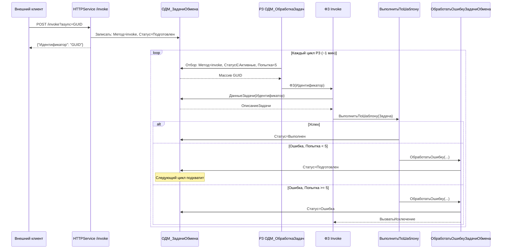
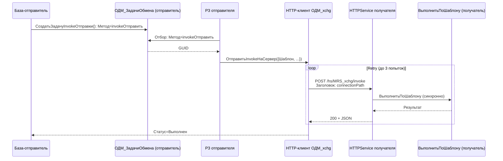

# Implementation Plan: Расширение HTTP-сервиса invoke

**Based on:** `docs/CODEMAPS/invoke-extension-architecture.md`
**Версия подсистемы:** 0.0.0.1
**Платформа:** 8.3.24+
**Дата плана:** 2026-05-28

---

## Overview

Расширение подсистемы `ОДМ_xchg` для HTTP-сервиса `/invoke`: добавление очереди (обработка async-invoke через регламентное задание), повтора при ошибках (retry до 5 попыток через возврат статуса `Подготовлен`), исходящего invoke для межбазового обмена (без новых URL), и предпросмотра JSON-тела запроса на форме шаблона.

**Scope:** Только invoke-методы. Существующие `query` и `objectPOST` не затрагиваются глобально — изменение только в блоке `Исключение` `ВыполнитьПоШаблону`, но с обратной совместимостью.

---

## Requirements

1. **Очередь (async invoke)** — задачи с `Метод = "invoke"` должны подхватываться регламентным заданием `ОДМ_ОбработкаЗадач` и выполняться в фоновых заданиях
2. **Повтор (retry)** — при ошибке invoke-задачи возвращаются в статус `Подготовлен` (до лимита попыток = 5)
3. **Исходящий invoke** — возможность отправки invoke в другую базу через существующий endpoint `/invoke` с заголовком `connectionPath`
4. **Предпросмотр JSON** — форма элемента справочника `ОДМ_МетодыИнтеграции` позволяет сформировать пример JSON-запроса
5. **Режимы «Очередь» и «Предпросмотр»** — HTTP-сервис поддерживает явное указание `Режим: "Очередь"` и `Режим: "Предпросмотр"` в теле запроса без выполнения шаблона

## Assumptions

- Платформа 8.3.24+ (доступен `Выполнить` с аргументами в контексте)
- Регламентное задание `ОДМ_ОбработкаЗадач` запускается периодически (стандартно ~1 мин)
- `ОбработкаУстаревшихЗадач` уже финализирует задачи с `Попытка >= 5` и статусом в активных — менять не нужно
- `ХарактеристикиДоступа` для `/invoke` читает `connectionPath` из заголовка — это сохраняется
- Новые реквизиты справочника добавляются через `1c-metadata-manage` skill (не ручное XML)
- Форма элемента редактируется через `1c-metadata-manage` skill

## Assumptions — уточнения по кодовой базе

- `ВыполнитьПоШаблону` уже инкрементирует `Попытка++` в начале (строка 222) — защита от гонки
- `ФоновыеЗадания.Выполнить` с ключом `Идентификатор` не запустит второе задание при активном первом
- `Конструктор_ВнешнийИнтерфейс` использует `Обработки[ИмяИнтерфейса].Создать()` — создаёт объект DataProcessor `ОДМ_xchg` с атрибутами `АдресСервера`, `Порт`, `ИмяБазы` и т.д.
- Существующий код роутера в `ОбработатьВходящуюЗадачу` дублирует диспетчеризацию в HTTP и РЗ — **только добавляем новые ветки**, не рефакторим

---

## Metadata Changes

### New Objects — нет

Все изменения — модификация существующих объектов.

### Modified Objects

| Объект | Изменения |
|--------|-----------|
| `CommonModules/ОДМ_РегламентныеЗадания/Ext/Module.bsl` | 4 новых метода + 2 строки в `ОДМ_ОбработкаЗадач` |
| `CommonModules/ОДМ_ОбменДанными/Ext/Module.bsl` | `ОбработатьОшибкуЗадачиОбмена()` + модификация `ВыполнитьПоШаблону` + `СоздатьЗадачуInvokeОтправки()` + `СформироватьПримерJSONЗапроса()` + `ПолучитьЗначениеЗаглушкуПоТипу()` |
| `DataProcessors/ОДМ_xchg/Ext/ObjectModule.bsl` | Новый метод `ОтправитьInvokeНаСервер()` |
| `HTTPServices/ОДМ_xchg/Ext/Module.bsl` | Режимы «Очередь» и «Предпросмотр» в `ОбработатьВходящуюЗадачу` |
| `Catalogs/ОДМ_МетодыИнтеграции.xml` | Три новых реквизита: `НаправлениеОбмена`, `ПримерJSONЗапроса`, `ПримерJSONОтвета` |
| `Catalogs/ОДМ_МетодыИнтеграции/Forms/ФормаЭлемента/Ext/Form.xml` | Новая страница «Предпросмотр JSON» |
| `Catalogs/ОДМ_МетодыИнтеграции/Forms/ФормаЭлемента/Ext/Form/Module.bsl` | Обработчик кнопки «Сформировать пример» |

---

## Implementation Steps

### Phase 1: Retry-механизм (Фаза 3 архитектуры)

> **Причина порядка:** retry — фундамент. Без него async-invoke при ошибке будет фатален с первой попытки. Строим первым, чтобы фазы 2 и 3 уже работали с повтором.

#### Step 1.1: `ОбработатьОшибкуЗадачиОбмена()` — новый метод
- **Файл:** `CommonModules/ОДМ_ОбменДанными/Ext/Module.bsl`
- **Действие:** Добавить экспортную процедуру `ОбработатьОшибкуЗадачиОбмена(ОписаниеЗадачи, ТекстОшибки)` — см. codemap строки 413-438.
  - Аккумулирует ошибку: `ОписаниеЗадачи.Ошибка = ОписаниеЗадачи.Ошибка + Символы.ПС + ТекстОшибки`
  - Если метод = `"invoke"` или `"invokeОтправить"` И `Попытка < КоличествоПопытокНаЗадачу()` → статус = `Подготовлен`, **НЕ вызываем исключение** (РЗ подхватит)
  - Иначе → статус = `Ошибка` + `ВызватьИсключение`
- **Место вставки:** после `Конструктор_ОписаниеЗадачи` (строка 428) или в конец модуля, перед последней процедурой
- **Зависимости:** `ОДМ_РегламентныеЗадания.КоличествоПопытокНаЗадачу()` — уже существует, возвращает 5
- **Сложность:** Simple (20 строк, чистый новый метод)
- **Риск:** Low — не вызывается ниоткуда до шага 1.2

#### Step 1.2: Модификация `ВыполнитьПоШаблону` — замена блока `Исключение`
- **Файл:** `CommonModules/ОДМ_ОбменДанными/Ext/Module.bsl`
- **Действие:** Заменить блок `Исключение` (строки 287-295 текущего кода — `ТекстОшибки = ОписаниеОшибки() ... ВызватьИсключение`) на новый (см. codemap строки 458-465):

  ```bsl
  Исключение
      ТекстОшибки = ОписаниеОшибки();
      ОбработатьОшибкуЗадачиОбмена(ОписаниеЗадачи, ТекстОшибки);
      РегистрыСведений.ОДМ_ЗадачиОбмена.ЗаписатьДанныеЗадач(ОписаниеЗадачи);
      // ОбработатьОшибкуЗадачиОбмена сама решит: выбросить исключение или нет
  КонецПопытки;
  ```

- **Внимание:** существующий блок содержит guard `Если ОписаниеЗадачи.Статус <> Ошибка Тогда` — это нужно для типа «Обработчик», который может сам установить статус. Новая `ОбработатьОшибкуЗадачиОбмена` **всегда** перезаписывает статус (либо `Подготовлен`, либо `Ошибка`). При вызове из «Обработчик»-шаблона тот сначала устанавливает свой статус (например, `Завершён`), а потом выбрасывает исключение — тогда retry для invoke отработает корректно. Для не-invoke методов (`query`/`objectPOST`) поведение **идентично текущему** — сразу `Ошибка` + исключение.
- **Зависимости:** Step 1.1
- **Сложность:** Simple (замена ~8 строк на ~4 строки)
- **Риск:** Medium — затрагивает все шаблоны. Важно проверить: синхронный invoke с ошибкой → HTTP 400 (без изменений). Async invoke с ошибкой → статус `Подготовлен` при Попытка < 5, `Ошибка` при Попытка ≥ 5.

**Проверка Phase 1:**
1. `syntaxcheck` для `ОДМ_ОбменДанными.Ext.Module.bsl`
2. Ручная проверка: синхронный `POST /invoke` с ошибкой в шаблоне → HTTP 400, статус `Ошибка` (без изменений)

---

### Phase 2: Регламентная обработка invoke — приём (Фаза 1 архитектуры)

#### Step 2.1: `ОбработкаЗаданий_Invoke()` — отбор задач для invoke
- **Файл:** `CommonModules/ОДМ_РегламентныеЗадания/Ext/Module.bsl`
- **Действие:** Добавить экспортную процедуру `ОбработкаЗаданий_Invoke()` — точная копия паттерна `ОбработкаЗаданий_Запросы` (строки 71-91), но с `Метод = "invoke"` и вызовом ФЗ `ОбработкаЗадания_ВыполнитьInvoke`. См. codemap строки 173-194.
- **Место вставки:** после `ОбработкаЗаданий_ЗаписьОбъектов` (строка 113)
- **Зависимости:** Step 2.2 (метод worker-а)
- **Сложность:** Simple (копипаст с заменой 3 значений)
- **Риск:** Low

#### Step 2.2: `ОбработкаЗадания_ВыполнитьInvoke(Идентификатор)` — worker для invoke
- **Файл:** `CommonModules/ОДМ_РегламентныеЗадания/Ext/Module.bsl`
- **Действие:** Добавить экспортную процедуру — worker, вызываемый из ФЗ:
  ```bsl
  Процедура ОбработкаЗадания_ВыполнитьInvoke(Знач Идентификатор) Экспорт
      Задача = РегистрыСведений.ОДМ_ЗадачиОбмена.ДанныеЗадачи(Идентификатор);
      ОДМ_ОбменДанными.ВыполнитьПоШаблону(Задача);
  КонецПроцедуры
  ```
- **Зависимости:** Phase 1 (retry в `ВыполнитьПоШаблону` уже есть)
- **Сложность:** Simple (5 строк)
- **Риск:** Low

#### Step 2.3: Регистрация invoke в `ОДМ_ОбработкаЗадач` — +1 строка
- **Файл:** `CommonModules/ОДМ_РегламентныеЗадания/Ext/Module.bsl`
- **Действие:** В процедуре `ОДМ_ОбработкаЗадач` (строка 2), после строки 13 (`ФоновыеЗадания.Выполнить(...ОбработкаЗаданий_ЗаписьОбъектов...)`), добавить:
  ```bsl
  ФоновыеЗадания.Выполнить("ОДМ_РегламентныеЗадания.ОбработкаЗаданий_Invoke", , "ОбработкаЗаданий_Invoke");
  ```
- **Место:** в блоке `//FIXME: плохой роутер` между `//<-` и следующей строкой `ОДМ_ОбменДанными.ОтправитьДанные...`
- **Зависимости:** Step 2.1, Step 2.2
- **Сложность:** Simple (1 строка)
- **Риск:** Low

**Проверка Phase 2:**
1. `syntaxcheck` для `ОДМ_РегламентныеЗадания.Ext.Module.bsl`
2. Ручная: `POST /invoke?async=<GUID>` → запись в регистр, через ~1 мин РЗ обработает → статус `Выполнен`

---

### Phase 3: Исходящий invoke между базами (Фаза 2 архитектуры)

#### Step 3.1: `ОтправитьInvokeНаСервер()` — HTTP-клиент для invoke
- **Файл:** `DataProcessors/ОДМ_xchg/Ext/ObjectModule.bsl`
- **Действие:** Добавить экспортную функцию `ОтправитьInvokeНаСервер(ПараметрыInvoke, Асинхронно, КоличествоПопыток)` — см. codemap строки 228-277.
  - URL: `/<ИмяБазы>/hs/MRS_xchg/invoke` (+ `?async=<UUID>` при Асинхронно)
  - Заголовок: `connectionPath` = `СтрокаСоединенияИнформационнойБазы()`
  - Тело: `СериализоватьJSON(ПараметрыInvoke)`
  - Retry: до `КоличествоПопыток` (по умолчанию 3) с прогрессивной паузой `Попытка * 1000` мс
  - Ответ 200 → десериализация JSON, возврат структуры
- **Место вставки:** после `ОтправитьОбъектНаСервер` (строка 147)
- **Важно:** Паттерн повторяет существующие `ОтправитьЗапросНаСервер` и `ОтправитьОбъектНаСервер`, но с retry-циклом. В существующих методах retry нет — НЕ добавляем.
- **Зависимости:** `ОДМ_ОбменДанными.СериализоватьJSON`, `ОДМ_ОбменДанными.ДесериализоватьJSON`, `Конструктор_Заголовки`, `УстановитьХТТПСоединение`, `ВызватьHTTPМетод` — все уже существуют
- **Сложность:** Moderate (45 строк, новый паттерн с retry)
- **Риск:** Medium — `СтрокаСоединенияИнформационнойБазы()` может быть пустой в файловой базе. Документ не предусматривает этот случай. Решение: если пустая — подставлять `"localhost"` или оставлять пустой (получатель увидит пустой `connectionPath` и `ХарактеристикиДоступа` создаст новую базу без известной строки подключения — поведение аналогично текущему).

#### Step 3.2: `СоздатьЗадачуInvokeОтправки()` — создание задачи на отправку
- **Файл:** `CommonModules/ОДМ_ОбменДанными/Ext/Module.bsl`
- **Действие:** Добавить экспортную функцию `СоздатьЗадачуInvokeОтправки(БазаПолучатель, КодШаблона, Параметры, ДопПараметры)` — см. codemap строки 287-326.
  - Создаёт запись в `ОДМ_ЗадачиОбмена` с `Метод = "invokeОтправить"`, `Статус = Подготовлен`
  - В `Параметры` сохраняет: `Шаблон`, `БазаПолучатель`, `Параметры`, и опционально `АдресСервера`, `Порт`, `Логин`, `Пароль`
  - Возвращает GUID созданной задачи как строку
- **Место вставки:** после `Конструктор_ОписаниеЗадачи` или в блок экспортных методов
- **Зависимости:** `Конструктор_ОписаниеЗадачи`, `РегистрыСведений.ОДМ_ЗадачиОбмена.ЗаписатьДанныеЗадач` — уже существуют
- **Сложность:** Moderate (30 строк, новый публичный API)
- **Риск:** Low

#### Step 3.3: `ОбработкаЗаданий_InvokeОтправить()` + worker — отбор и обработка исходящих
- **Файл:** `CommonModules/ОДМ_РегламентныеЗадания/Ext/Module.bsl`
- **Действие:**
  1. Добавить `ОбработкаЗаданий_InvokeОтправить()` — отбор задач с `Метод = "invokeОтправить"`, запуск ФЗ. Паттерн — см. codemap строки 335-356.
  2. Добавить `ОбработкаЗадания_ВыполнитьInvokeОтправить(Идентификатор)` — worker, см. codemap строки 358-394:
     - Читает задачу через `ДанныеЗадачи`
     - Создаёт `ВнешнийИнтерфейс` через `Конструктор_ВнешнийИнтерфейс()`
     - Заполняет `ИмяБазы`, опционально `АдресСервера`, `Порт`
     - Формирует тело invoke: `{ "Шаблон": ..., ...Параметры }`
     - Вызывает `ВнешнийИнтерфейс.ОтправитьInvokeНаСервер(ТелоInvoke)`
     - При успехе: статус `Выполнен`, результат
     - При ошибке: `ОбработатьОшибкуЗадачиОбмена(Задача, ТекстОшибки)`
     - Сохраняет задачу
- **Зависимости:** Step 3.1 (`ОтправитьInvokeНаСервер`), Step 1.1 (`ОбработатьОшибкуЗадачиОбмена`)
- **Сложность:** Moderate (55 строк, координация нескольких компонентов)
- **Риск:** Medium — важно правильно передать параметры подключения; `Конструктор_ВнешнийИнтерфейс` может упасть, если обработка `ОДМ_xchg` не найдена — обработчик `Исключение` создаёт структуру-заглушку, так что код не упадёт, но вызов HTTP не сработает.

#### Step 3.4: Регистрация `invokeОтправить` в `ОДМ_ОбработкаЗадач` — +1 строка
- **Файл:** `CommonModules/ОДМ_РегламентныеЗадания/Ext/Module.bsl`
- **Действие:** В `ОДМ_ОбработкаЗадач`, после строки из Step 2.3, добавить:
  ```bsl
  ФоновыеЗадания.Выполнить("ОДМ_РегламентныеЗадания.ОбработкаЗаданий_InvokeОтправить", , "ОбработкаЗаданий_InvokeОтправить");
  ```
- **Зависимости:** Step 3.3
- **Сложность:** Simple (1 строка)
- **Риск:** Low

**Проверка Phase 3:**
1. `syntaxcheck` для трёх файлов
2. Ручная: создание задачи через `СоздатьЗадачуInvokeОтправки` → РЗ подхватывает → HTTP-вызов → ответ от удалённой базы → статус `Выполнен`

---

### Phase 4: Предпросмотр JSON (Фаза 4 архитектуры)

#### Step 4.1: Новые реквизиты справочника `ОДМ_МетодыИнтеграции`
- **Файл:** `Catalogs/ОДМ_МетодыИнтеграции.xml` (через `1c-metadata-manage` skill)
- **Действие:** Добавить три реквизита:

  | Реквизит | Тип | Использование |
  |----------|-----|---------------|
  | `НаправлениеОбмена` | `Строка(20)` | `ДляЭлемента` |
  | `ПримерJSONЗапроса` | `Строка(0)` — неограниченная | `ДляЭлемента` |
  | `ПримерJSONОтвета` | `Строка(0)` — неограниченная | `ДляЭлемента` |

- **Важно:** Использовать skill `1c-metadata-manage` — не править XML вручную
- **Зависимости:** Нет
- **Сложность:** Simple (3 реквизита)
- **Риск:** Low — изолированное добавление, нигде не используется

#### Step 4.2: `СформироватьПримерJSONЗапроса()` + `ПолучитьЗначениеЗаглушкуПоТипу()`
- **Файл:** `CommonModules/ОДМ_ОбменДанными/Ext/Module.bsl`
- **Действие:** Добавить две функции — см. codemap строки 512-551.
  - `СформироватьПримерJSONЗапроса(ШаблонСсылка)`: читает объект справочника, строит структуру `{ "Шаблон": Код, Параметр1: заглушка, ... }` на основе ТЧ `ВходныеПараметры`
  - `ПолучитьЗначениеЗаглушкуПоТипу(ИмяТипа)`: возвращает заглушку в зависимости от типа (`"Строка"` → `"строка"`, `"Число"` → `0`, `"Булево"` → `Истина`, `"Дата"` → `"2026-01-01T00:00:00"`, иначе → `"значение"`)
  - Результат — сериализованный JSON (`СериализоватьJSON(Данные)`)
- **Место вставки:** после `Конструктор_ОписаниеЗадачи`
- **Зависимости:** Step 4.1 (реквизиты справочника должны существовать, но код ссылается только на ТЧ `ВходныеПараметры` — она уже есть)
- **Сложность:** Simple (35 строк, чистые функции)
- **Риск:** Low

#### Step 4.3: Модификация формы элемента — страница «Предпросмотр JSON»
- **Файлы:** 
  - `Catalogs/ОДМ_МетодыИнтеграции/Forms/ФормаЭлемента/Ext/Form.xml`
  - `Catalogs/ОДМ_МетодыИнтеграции/Forms/ФормаЭлемента/Ext/Form/Module.bsl`
- **Действие:**
  1. Добавить новую страницу «Предпросмотр JSON» на существующую `ГруппаСтраниц` формы
  2. На странице:
     - Поле `НаправлениеОбмена` (выпадающий список: `Прием`/`Отправка`/`Оба`)
     - Поле `ПримерJSONЗапроса` (многострочное, высота ~10 строк, только чтение)
     - Поле `ПримерJSONОтвета` (многострочное, высота ~10 строк, только чтение)
     - Кнопка «Сформировать пример запроса» (команда формы)
  3. В модуле формы добавить:
     ```bsl
     &НаКлиенте
     Процедура СформироватьПримерЗапроса(Команда)
         СформироватьПримерЗапросаНаСервере();
     КонецПроцедуры

     &НаСервере
     Процедура СформироватьПримерЗапросаНаСервере()
         ПримерJSON = ОДМ_ОбменДанными.СформироватьПримерJSONЗапроса(Объект.Ссылка);
         Объект.ПримерJSONЗапроса = ПримерJSON;
     КонецПроцедуры
     ```
- **Зависимости:** Step 4.1, Step 4.2
- **Сложность:** Moderate (форма + клиент-серверный обработчик)
- **Риск:** Medium — правка формы может сломать вёрстку. Использовать `1c-metadata-manage` skill.
- **Примечание:** Для отображения JSON можно рассмотреть переиспользование паттерна `ОДМ_JsonEditor` из `ФормаЗаписи` регистра `ОДМ_ЗадачиОбмена`, но для «только чтение» достаточно обычного многострочного поля.

**Проверка Phase 4:**
1. `verify_xml` для `Catalogs/ОДМ_МетодыИнтеграции.xml`
2. `syntaxcheck` для `ОДМ_ОбменДанными.Ext.Module.bsl` и модуля формы
3. Ручная: открыть форму шаблона → вкладка «Предпросмотр JSON» → кнопка «Сформировать пример» → поле заполняется валидным JSON

---

### Phase 5: Режимы «Очередь» и «Предпросмотр» в HTTP-сервисе (Фаза 5 архитектуры)

#### Step 5.1: Режим «Предпросмотр» в `ОбработатьВходящуюЗадачу`
- **Файл:** `HTTPServices/ОДМ_xchg/Ext/Module.bsl`
- **Действие:** В функции `ОбработатьВходящуюЗадачу`, после строки 276 (`РезультатМетода = Новый Структура(...)`) и до `Если ОписаниеЗадачи.АсинхронныйВызов Тогда` (строка ~305 в реальном коде), добавить проверку `Режим: "Предпросмотр"` — см. codemap строки 560-583.
  
  **Логика:** если в `Параметры` есть `Режим = "Предпросмотр"` → формируем структуру с `ТелоЗапроса`, `URL`, `МетодHTTP`, опционально `ТипШаблона` и `НаправлениеОбмена` → возвращаем без выполнения шаблона.

- **Зависимости:** Step 4.1 (нужен реквизит `НаправлениеОбмена` для заполнения)
- **Сложность:** Simple (20 строк)
- **Риск:** Low — ранний return, не затрагивает существующие пути

#### Step 5.2: Режим «Очередь» в `ОбработатьВходящуюЗадачу`
- **Файл:** `HTTPServices/ОДМ_xchg/Ext/Module.bsl`
- **Действие:** В синхронном блоке (после `Иначе` на строке ~315), **перед** вызовом шаблона, добавить проверку `Режим: "Очередь"` — см. codemap строки 594-605.

  **Логика:** если `Режим = "Очередь"` → записать задачу в регистр со статусом `Подготовлен`, вернуть `Идентификатор` и статус `"Подготовлен"`, **не выполнять шаблон**.

  **Отличие от `?async`:** `?async=UUID` в URL — это внешний async (клиент передаёт GUID). `Режим: "Очередь"` — это явное указание в теле: «положи в очередь, не выполняй сейчас». Оба пути ведут к записи в регистр и обработке через РЗ.

- **Зависимости:** Phase 2 (РЗ должно уметь обрабатывать invoke)
- **Сложность:** Simple (8 строк)
- **Риск:** Low — ещё один ранний return

**Проверка Phase 5:**
1. `syntaxcheck` для `HTTPServices/ОДМ_xchg/Ext/Module.bsl`
2. Ручная: `POST /invoke` с `{"Шаблон": "...", "Режим": "Предпросмотр"}` → ответ с метаинформацией, без выполнения шаблона
3. Ручная: `POST /invoke` с `{"Шаблон": "...", "Режим": "Очередь"}` → ответ с `Идентификатор` и `Статус: "Подготовлен"`, РЗ обработает позже

---

## Data Flow Diagrams

### Полный цикл: async invoke с retry



### Межбазовый обмен (исходящий invoke)



---

## Testing Strategy

### Функциональные тесты

| # | Сценарий | Ожидаемый результат | Фаза |
|---|----------|---------------------|------|
| 1 | `POST /invoke` без async (синхронно) | Шаблон выполняется, HTTP 200 | Регресс |
| 2 | `POST /invoke?async=GUID` | Запись в регистр, HTTP 200 с Идентификатор | Фаза 2 |
| 3 | Async invoke → РЗ обрабатывает → успех | Статус = `Выполнен` | Фаза 2 |
| 4 | Async invoke → ошибка в шаблоне (попытка 1) | Статус = `Подготовлен`, Ошибка непустая | Фаза 1 + 2 |
| 5 | Async invoke → ошибка 5 раз | Статус = `Ошибка` | Фаза 1 + 2 |
| 6 | `СоздатьЗадачуInvokeОтправки` → РЗ → HTTP 200 | Статус = `Выполнен` на отправителе | Фаза 3 |
| 7 | `СоздатьЗадачуInvokeОтправки` → сеть недоступна → retry | 3 попытки HTTP, затем статус `Подготовлен` | Фаза 3 |
| 8 | Кнопка «Сформировать пример» на форме шаблона | Поле `ПримерJSONЗапроса` заполняется валидным JSON | Фаза 4 |
| 9 | `POST /invoke` с `Режим: "Предпросмотр"` | Ответ с метаинформацией, шаблон НЕ выполняется | Фаза 5 |
| 10 | `POST /invoke` с `Режим: "Очередь"` | Запись в регистр, ответ с Идентификатор | Фаза 5 |
| 11 | `POST /query`, `POST /object` | Работают без изменений | Регресс |

### Edge Cases

| Сценарий | Поведение |
|----------|-----------|
| Пустой `Шаблон` в параметрах | `ВыполнитьПоШаблону` → исключение → retry или Ошибка |
| `connectionPath` пустой (файловая база) | `ХарактеристикиДоступа` создаст новую базу без строки подключения |
| Два одновременных запуска РЗ | `ФоновыеЗадания.Выполнить` с тем же ключом не дублирует |
| `КоличествоПопытокНаЗадачу()` возвращает 0 | `Попытка < 0` — никогда не истина → задачи не подхватываются. Не обрабатываем (уже 5) |
| `Конструктор_ВнешнийИнтерфейс` падает (нет обработки) | Создаётся структура-заглушка → HTTP-вызов упадёт → retry |

---

## Risks & Mitigations

| Риск | Влияние | Вероятность | Смягчение |
|------|--------|-------------|-----------|
| **Изменение блока `Исключение` в `ВыполнитьПоШаблону` ломает обработчик «Обработчик»** — шаблон типа «Обработчик» сам устанавливает статус перед исключением | Medium | Low | Новая `ОбработатьОшибкуЗадачиОбмена` перезаписывает статус. Для не-invoke — сразу `Ошибка` (как сейчас). Для invoke — `Подготовлен` (новое поведение). Проверить на шаблоне «Обработчик» с ошибкой |
| **`ОтправитьInvokeНаСервер` вызывает `Пауза` в серверном контексте** — `Пауза` в не-интерактивном контексте не работает вне формы | High | Medium | `Пауза` на сервере поднимает исключение или игнорируется. Решение: использовать синхронный `ВызватьHTTPМетод` без паузы, retry делать на уровне РЗ (новый цикл) |
| **Гонка при частом запуске РЗ** — две итерации РЗ могут подхватить одну задачу | Low | Low | `Попытка++` в начале `ВыполнитьПоШаблону` + ключ ФЗ по `Идентификатор` — вторая итерация увидит `Попытка >= 5` или активное ФЗ и не запустит |
| **Новые реквизиты справочника требуют реструктуризации** | Low | Low | Добавление реквизитов в не-иерархический справочник без предопределённых — безопасно |

### Критическое уточнение: `Пауза` в серверном контексте

В `ОтправитьInvokeНаСервер` (Phase 3, Step 3.1) документ предлагает retry с `Пауза(Попытка * 1000)`. **В серверном неинтерактивном контексте `Пауза` бесполезна** — она либо не работает, либо выбрасывает исключение.

**Решение:** Исключить `Пауза` из реализации. Вместо этого:
- На стороне HTTP-клиента — retry без паузы (3 быстрых попытки, если ошибка сети — часто решается мгновенным переподключением)
- При исчерпании попыток — возврат в `Подготовлен` через `ОбработатьОшибкуЗадачиОбмена` → следующий цикл РЗ повторит позже

```bsl
// Корректированный retry-цикл (без Пауза)
Для Попытка = 1 По КоличествоПопыток Цикл
    Попытка
        Если Соединение = Неопределено Тогда
            УстановитьХТТПСоединение();
        КонецЕсли;
        ЗапросHTTP = Новый HTTPЗапрос(АдресРесурса, ЗаголовкиВызова);
        ЗапросHTTP.УстановитьТелоИзСтроки(ТелоJSON);
        ОтветHTTP = Соединение.ВызватьHTTPМетод("POST", ЗапросHTTP);
        Если ОтветHTTP.КодСостояния = 200 Тогда
            Прервать;
        КонецЕсли;
    Исключение
        Если Попытка = КоличествоПопыток Тогда
            ВызватьИсключение;
        КонецЕсли;
        // Без Пауза — быстрый retry для transient-ошибок
    КонецПопытки;
КонецЦикла;
```

Это сохраняет семантику retry, но не зависит от интерактивного контекста.

---

## Dependencies

### SSL (БСП) модули — не требуются

Подсистема `ОДМ_xchg` не использует БСП, кроме:
- `ПриНачалеВыполненияРегламентногоЗадания` в `ОДМ_РегламентныеЗадания` (уже есть)

### Внутренние зависимости подсистемы

```
ОДМ_ОбменДанными.ОбработатьОшибкуЗадачиОбмена
    └── ОДМ_РегламентныеЗадания.КоличествоПопытокНаЗадачу()

ОДМ_ОбменДанными.ВыполнитьПоШаблону (модификация)
    └── ОДМ_ОбменДанными.ОбработатьОшибкуЗадачиОбмена

ОДМ_РегламентныеЗадания.ОбработкаЗаданий_Invoke
    └── ОДМ_ОбменДанными.ВыполнитьПоШаблону (через ФЗ)

ОДМ_РегламентныеЗадания.ОбработкаЗаданий_InvokeОтправить
    ├── DataProcessors/ОДМ_xchg.ОтправитьInvokeНаСервер
    └── ОДМ_ОбменДанными.ОбработатьОшибкуЗадачиОбмена

ОДМ_ОбменДанными.СформироватьПримерJSONЗапроса
    └── Catalogs/ОДМ_МетодыИнтеграции.ВходныеПараметры (ТЧ)

HTTPService/ОДМ_xchg.ОбработатьВходящуюЗадачу (модификация)
    ├── Режим "Предпросмотр" → Catalogs/ОДМ_МетодыИнтеграции.НаправлениеОбмена
    └── Режим "Очередь" → РегистрыСведений.ОДМ_ЗадачиОбмена.ЗаписатьДанныеЗадач
```

### Внешние системы — нет

### Конфигурационные требования
- Регламентное задание `ОДМ_ОбработкаЗадач` должно быть активно
- HTTP-сервис `ОДМ_xchg` должен быть опубликован на веб-сервере
- `connectionPath` (строка соединения ИБ) должна быть доступна через `СтрокаСоединенияИнформационнойБазы()`

---

## Success Criteria

- [ ] **F1.** Async-invoke через `?async=GUID` обрабатывается регламентным заданием (статус переходит `Подготовлен` → `Выполняется` → `Выполнен`)
- [ ] **F2.** Ошибка в async-invoke при попытке < 5 → статус возвращается в `Подготовлен`, задача повторяется
- [ ] **F3.** Ошибка в async-invoke при попытке ≥ 5 → статус `Ошибка`, задача не повторяется
- [ ] **F4.** `СоздатьЗадачуInvokeОтправки` создаёт задачу, РЗ отправляет invoke в другую базу через HTTP-клиент
- [ ] **F5.** Существующие методы `query` и `objectPOST` работают без изменений (синхронно и async)
- [ ] **F6.** Кнопка «Сформировать пример запроса» на форме шаблона генерирует валидный JSON
- [ ] **F7.** `Режим: "Предпросмотр"` в теле `/invoke` возвращает метаинформацию без выполнения шаблона
- [ ] **F8.** `Режим: "Очередь"` в теле `/invoke` кладёт задачу в регистр без немедленного выполнения
- [ ] **F9.** Все изменённые модули проходят `syntaxcheck` без ошибок
- [ ] **F10.** Все изменённые файлы метаданных проходят `verify_xml`

---

## Build Order Summary

| # | Шаг | Файл | ~Строк | Проверка |
|---|-----|------|--------|----------|
| 1.1 | `ОбработатьОшибкуЗадачиОбмена()` | `ОДМ_ОбменДанными` | +20 | `syntaxcheck` |
| 1.2 | Замена `Исключение` в `ВыполнитьПоШаблону` | `ОДМ_ОбменДанными` | ~8 изм. | `syntaxcheck` + ручная |
| 2.1 | `ОбработкаЗаданий_Invoke()` | `ОДМ_РегламентныеЗадания` | +20 | `syntaxcheck` |
| 2.2 | `ОбработкаЗадания_ВыполнитьInvoke()` | `ОДМ_РегламентныеЗадания` | +6 | `syntaxcheck` |
| 2.3 | +1 строка в `ОДМ_ОбработкаЗадач` | `ОДМ_РегламентныеЗадания` | +1 | `syntaxcheck` + ручная |
| 3.1 | `ОтправитьInvokeНаСервер()` | `DataProcessors/ОДМ_xchg` | +45 | `syntaxcheck` |
| 3.2 | `СоздатьЗадачуInvokeОтправки()` | `ОДМ_ОбменДанными` | +30 | `syntaxcheck` |
| 3.3 | `ОбработкаЗаданий_InvokeОтправить()` + worker | `ОДМ_РегламентныеЗадания` | +55 | `syntaxcheck` |
| 3.4 | +1 строка в `ОДМ_ОбработкаЗадач` | `ОДМ_РегламентныеЗадания` | +1 | `syntaxcheck` + ручная |
| 4.1 | Новые реквизиты справочника | `ОДМ_МетодыИнтеграции.xml` | +80 XML | `verify_xml` |
| 4.2 | `СформироватьПримерJSONЗапроса()` + заглушки | `ОДМ_ОбменДанными` | +35 | `syntaxcheck` |
| 4.3 | Форма: страница «Предпросмотр JSON» | `ФормаЭлемента` + модуль | +70 XML, +10 BSL | `verify_xml` + `syntaxcheck` |
| 5.1 | Режим «Предпросмотр» | `HTTPServices/ОДМ_xchg` | +20 | `syntaxcheck` |
| 5.2 | Режим «Очередь» | `HTTPServices/ОДМ_xchg` | +8 | `syntaxcheck` + ручная |

**Всего:** ~410 строк кода, ~150 строк XML, 15 шагов в 5 фазах.

---

## Примечания для разработчика

### Что НЕ делаем (scope boundaries)

- **Новые HTTP-сервисы / URL** — всё через существующий `/invoke`
- **Connector целиком** — только локальный retry-паттерн (3 попытки без `Пауза`)
- **Глобальный refactor retry для query/objectPOST** — только invoke-методы
- **Парные шаблоны в метаданных** — связь через код шаблона на стороне получателя
- **Изменение `ОДМ_ОбработкаУстаревшихЗадач`** — существующая логика покрывает новый invoke
- **Переписывание FIXME-роутера** — только добавляем новые ветки

### Ключевые решения (trade-offs)

1. **Один endpoint `/invoke`** — не создаём новых URL. Межбазовый обмен и внешние сервисы — через один `/invoke`
2. **Retry через возврат в `Подготовлен`** — та же запись меняет статус, `Попытка` как счётчик
3. **`connectionPath` заголовком** — консистентность с `ХарактеристикиДоступа`
4. **Без `Пауза` в retry** — корректировка против codemap: `Пауза` не работает в серверных ФЗ

### Обратная совместимость

| Сценарий | Было | Стало |
|----------|------|-------|
| `POST /invoke` синхронно | `ВыполнитьПоШаблону` → ответ | **Без изменений** |
| `POST /invoke?async=GUID` | Запись в регистр, **не обрабатывается РЗ** | Запись → **РЗ обрабатывает** |
| Ошибка в шаблоне (синхронно) | `Ошибка` + HTTP 400 | **Без изменений** |
| Ошибка в шаблоне (async) | `Ошибка` навсегда | **Повтор до 5 попыток** |
| `POST /query`, `POST /object` | Работают | **Без изменений** |
| `ОтправитьЗапросНаСервер`, `ОтправитьОбъектНаСервер` | Работают | **Без изменений** |

---

## Verification Checklist (для приёмки)

- [x] План покрывает все 4 gaps из codemap
- [x] План учитывает существующие идиомы кода (роутер, ФЗ, ДанныеЗадачи)
- [x] План включает проверку обратной совместимости
- [x] План документирует риск `Пауза` в серверном контексте и предлагает корректировку
- [x] План определяет границы scope (что НЕ делаем)
- [x] План содержит sequence-диаграммы для ключевых сценариев
- [x] План указывает конкретные файлы и строки для вставки
